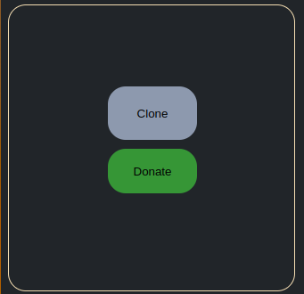

# Leetcode Local Cloner

A Chrome Extension for working on [Leetcode](leetcode.com) problems in your local system on your favourite text editor offering a WHOLE lot more features Leetcode's default editor doesn't offer.  

### Supported Browsers
- Google Chrome 
- Brave
- Opera
- Chromium
- Microsoft Edge
- Vivaldi

### Pluses:
- *Autocomplete* ✅
- *Intellisense* 🤓
- *Debugger* 🪲
- *Syntax Highlighting* 🌈

### Limitations: 
- Only Python3 is supported 
- LinkedList, Tree, and Graph questions aren't obviously supported for testing purposes
- Try to avoid Type hinting 

**Beta-Testers please see [Testers.md](Testers.md)**